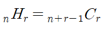

# [양궁대회](https://school.programmers.co.kr/learn/courses/30/lessons/92342) 살펴보기

## 팀원 풀이 해석 

### [1. 화경님 풀이](https://github.com/zero-to-dev/Algorithm/blob/main/companies/KAKAO/2022-KAKAO-BLIND-RECRUITMENT/Lv.-2-%EC%96%91%EA%B6%81%EB%8C%80%ED%9A%8C/hwakyung.md)


#### 사용된 개념 
- [itertools](https://docs.python.org/3/library/itertools.html)
  - 효과적인 loop 구성을 위해 반복자(iterator)를 생성하는 함수 

- [combinations_with_replacement](https://docs.python.org/3/library/itertools.html#itertools.combinations_with_replacement)
  - 중복조합 구현시 사용하는 모듈

- 중복조합
  - 중복 가능한 n개중에서 r개를 선택하는 경우의 수 (순서 상관 없음)
  -  

- 사용예시 
```python
from itertools import combinations_with_replacement
for combination in combinations_with_replacement(range(1,4),2):   
# 1~3의 숫자를 2개씩 뽑아서 중복조합 구현
    print(combination)
# 튜플로 반환

'''
  (1, 1)
  (1, 2)
  (1, 3)
  (2, 2)
  (2, 3)
  (3, 3)
'''

# 한줄 구현
import itertools
print(list(itertools.combinations_with_replacement(range(1,4),2)))

# [(1, 1), (1, 2), (1, 3), (2, 2), (2, 3), (3, 3)]
```
  
- 코드 뜯어보기
```python
from itertools import combinations_with_replacement

def solution(n, info):
    answer = [-1]
    max_gap = -1  # 점수차

    # 중복 조합으로 0~10점까지 n개 뽑기
    for combination in combinations_with_replacement(range(11), n):
        lion_list = [0] * 11  # 라이언의 과녁 점수
        print(combination)
        # combination에 해당하는 화살들을 라이언 과녁 점수에 넣기
        for i in combination:  # 중복조합으로 나오는 점수를 담은 튜플에서 앞에서부터 하나씩 점수 체킹
            lion_list[10 - i] += 1   # 튜플에는 점수가 내림차순으로 배열 & 해당 점수칸에 적중횟수 1증가
        lion, peach = 0, 0

        # 라이언과 어피치 점수칸별 비교(10점 -> .. -> 0점)
        for idx in range(11):
            # 라이언과 어피치 모두 한번도 화살을 맞히지 못하는 경우
            if info[idx] == 0 and lion_list[idx] == 0:
                continue  # 아래 코드를 실행하지 않고 건너뜀
            # 라이언이 어피치가 쏜 화살의 수 이상을 맞힌 경우
            elif lion_list[idx] > info[idx]:
                lion += 10 - idx   # 라이언이 해당 점수 가져감
            # 어피치가 라이언보다 많은 수의 화살을 맞힌 경우
            elif lion_list[idx] <= info[idx]:
                peach += 10 - idx   # 어피치가 해당 점수 가져감

        # 라이언의 점수가  더 높은 경우
        if lion > peach:
            # 기존보다 더 큰 점수차인 경우
            if lion - peach > max_gap:
                max_gap = lion - peach   # 최대 점수차 갱신
                answer = lion_list   # 이때의 라이언의 점수 리스트를 정답으로 갱신

    return answer

print("1번 케이스:", solution(5,[2,1,1,1,0,0,0,0,0,0,0]))  # [0,2,2,0,1,0,0,0,0,0,0]
print("2번 케이스:", solution(5,[2,1,1,1,0,0,0,0,0,0,0]))   # [-1]
print("3번 케이스", solution(5,[0,0,1,2,0,1,1,1,1,1,1]))  # [1,1,2,0,1,2,2,0,0,0,0]
print("4번 케이스", solution(10,[0,0,0,0,0,0,0,0,3,4,3]))   # [1,1,1,1,1,1,1,1,0,0,2]
```

- 중복조합으로 라이언이 쏠 수 있는 점수들의 조합을 모두 살펴보면서 라이언의 점수를 계산하고 어피치아 점수를 비교함
- (조건에 따라)점수 차이가 같은 경우<br>-> 낮은 점수의 비중이 큰 경우를 return<br>-> 따라서 낮은 점수부터 채우면서 라이언의 점수 게산
- 라이언의 점수가 어피치가 큰 경우에는, 점수차를 계산 비교하면서 갱신
- 수학적인 센스가 필요한 문제풀이였음 (조합)
- DFS, BFS등과 같은 알고리즘과 달리 중복조합 개념을 떠올릴 수 있다면 직관적으로 빠르게 해답을 도출해낼 수 있겠다는 생각이 들었음

<br><br>

### [2. 연주님 풀이](https://github.com/zero-to-dev/Algorithm/blob/main/companies/KAKAO/2022-KAKAO-BLIND-RECRUITMENT/Lv.-2-%EC%96%91%EA%B6%81%EB%8C%80%ED%9A%8C/yeonju.md)


#### 사용된 개념 

- [배열복사 (deep copy VS shallow copy)](https://wikidocs.net/16038)
- [collections](https://docs.python.org/ko/3/library/collections.html)
  - 컨테이너 데이터형 구현
  
- [collections.deque](https://wikidocs.net/104977)
  - 앞과 뒤에서 데이터를 처리할 수 있는 양방향 자료형 (스택 & 큐 모두 가능)


## 문제풀이 해설  - 비트마스크 알고리즘
```python
# https://school.programmers.co.kr/learn/courses/30/lessons/92342
# 아이디어 - 비트마스크(BitMask) 알고리즘

def solution(n, info):  # n: 화살의 개수, info: 어피치가 맞춘 과녁 점수들
    answer = [0 for _ in range(11)]   # 라이언 - 0~10점 (11개)
    tmp = [0 for _ in range(11)]   # 임시로 라이언이 쏜 화살 정보 저장
    maxDiff = 0    # 라이언-어피치 최대 차이값 (최대값 찾으면 tmp값을 answer에 저장)

    for subset in range(1, 1<<10):
    # 각각의 경우의 수는 비트 표현 부분집합으로 나타냄 (1점~10점에 맞춤/못맞춤 -> 총 10칸이므로 2^10이용)
    # range(1, 1<<10): 1을 원소개의 개수만큼 왼쪽으로 shift (0~1023). 공집합 0은 라이언이 이길 수 없으므로 1부터 시작
        ryan = 0   # 라이언의 점수
        apeach = 0   # 어피치의 점수
        cnt = 0  # 라이언이 쏜 화살의 개수 (n을 넘어가면 안되고, n보다 화살을 더 쏜경우 나머지는 0점에 맞춘걸로 기록)

        # 여기서는 라이언의 점수를 계산합니다
        for i in range(10):
            # i번째 원소가 부분집합에 존재하는지 확인
            # 0~9번째 인덱스 -> 1점~10점에 대응
            if subset & (1 << i):
                # i번째에 해당하는 과녁을 라이언이 이기는 경우
                # subset에 i번쨰 원소존재 & 1을 i번만큼 왼쪽으로 shift (i번째 비트가 1로 켜짐) => subset에 i번째 비트가 켜져있는지 확인할 수 있음
                ryan += (10-i)   # 라이언이 받아야할 점수: 10-i  (i가 0일때 10점, i=1일때 9점 ...)
                tmp[i] = info[i] + 1   # (라이언이 최소개수차이로 이기기 위해서) 어피치보다 이 과녁에 1발 더 쏘면 됨 (info[i]+1)
                cnt +=  tmp[i]  # 라이언이 쏜 화살의 개수  -> tmp[i]를 누적해줌
            else:
                # 라이언이 이기지 못하는 경우
                tmp[i] = 0   # 이기지 못하므로 화살을 안쓰면 됨
                if info[i]:
                    # 어피치가 화살이 1개라도 있는경우 무조건 어피치가 이김
                    apeach += 10-i   # 어피치가 이기므로 어피치의 점수 올림


        # for문 종료 이후 - 이제 cnt에 라이언이 사용한 화살의 개수가 새겨져 있음

        if n < cnt:  # cnt가 n보다 크면 사용하면 안되는 부분집합이므로
            continue  # 버림

        tmp[10] = n - cnt   # n-cnt(총 써야하는 화살개수 -실제 과녁에 맞춘 화살개수 = 남은화살) => 0점에 남은화살 모두를 넣음

        # 라이언점수- 어피치점수가 최대차이값과 같은 경우 (가장 낮은 점수를 맞힌 개수가 같은 경우)
        if ryan-apeach == maxDiff:
            for i in reversed(range(11)):   # 10점부터 ~ 0점까지비교
                if tmp[i] > answer[i]:    # 같은 자리 비교- 가장 낮은 점수가 더 많이 맞춘 경우
                    maxDiff = ryan - apeach
                    answer = tmp[:]
                    break   #
                elif tmp[i] < answer[i]:   # answer가 더 큰 경우
                    break   # 업데이트할 필요가 없음

        elif ryan-apeach > maxDiff:
            # 라이언의 점수 - 어피치의 점수가 최대차이값 갱신하는 경우
            # 최초의 masDiff는 0으로 초기화했으므로 apeach가 이기는 경우는 모두 무시됨
            # 점수가 동일한 경우도 무시됨
            # 즉, 라이언이 이기는 경우만 해당되므로 이때만 최대 점수차이값 업데이트 대상임
            maxDiff = ryan - apeach   # 최대 점수차이값 갱신
            answer = tmp[:]   # answer에 라이언의 화살정보를 복사

    if maxDiff == 0:
        # 라이언이 못이기는 경우
        answer = [-1]

    return answer


'''
* 규칙
- 해당점수에서 이길 수 있을때는 1발만 더 쏴서 점수를 획득
- 화살을 1발을 더쏴서 이기나 2발을 더 써서 이기나 같으므로 1발만 더 쏘고 이기도록 함 (최소의 화살로 최대의 점수 획득하기 위함)
- 동률일 경우 질 수밖에 없으므로 1점씩 내려가며 체크
- 해당점수에서 이길 수 없는 경우 바로 밑의 점수로 내려가서 그 점수를 획득 (반복)
- 가장 큰 점수차로 우승할 수 있는 방법이 여러가지 일 경우, 가장 낮은 점수를 더 많이 맞춘 경우를 return
- 가장 낮은 점수를 맞힌 개수가 같은 경우 계속해서 그 다음으로 낮은 점수를 더 많이 맞힌 경우를 리턴


* 아이디어 - BitMask Algorithm

- 이진수를 사용하는 컴퓨터 연산 방식을 이용하여, 정수의 이진수 표현을 자료 구조로 사용하는 기법
- 이진수 => 0(꺼져있다), 1(켜져있다)를 이용하므로 1bit로 두가지를 표현할 수 있음
- 수행시간이 빠름 (bit 연산이므로 O(1)시간에 구현되는 것이 많음 => 연산 횟수가 늘어날 수록 유용) 
- 코드가 짧음 & 메모리 사용량이 적음
'''

```

